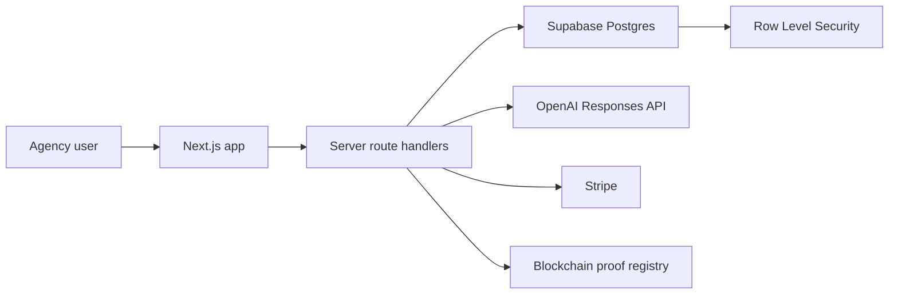

# AgencyOS AI

AI-native operating system for service agencies: CRM, billing, workflow automation, analytics, and blockchain audit proofs in one production-grade SaaS platform.

## Why This Project Exists

Small service agencies often run sales, operations, invoices, and client history across spreadsheets, chat apps, email, and disconnected CRMs. AgencyOS AI is designed to centralize agency operations while adding practical AI workflows that save time for owners, managers, and agents.

This repository is the 12-month public portfolio build for a Senior Full-Stack AI SaaS Engineer position. The goal is to demonstrate product thinking, maintainable architecture, secure multi-tenant design, AI integration, testing, CI/CD, and optional blockchain audit infrastructure.

## Core Features

- Multi-tenant agency workspace with role-based access control
- CRM for clients, leads, deals, tasks, and activity history
- AI assistant for client summaries, message drafting, and document review
- Billing foundation for invoices, subscriptions, and payment tracking
- Operational analytics for pipeline, revenue, agent performance, and retention
- Blockchain proof module for verifiable hashes of important records
- Production practices: tests, CI, documentation, environment hygiene, and security notes

## Tech Stack

| Area | Stack |
| --- | --- |
| Frontend | Next.js, React, TypeScript, Tailwind CSS |
| Backend | Next.js route handlers and server-side services |
| Database/Auth | Supabase Postgres, Supabase Auth, Row Level Security |
| AI | OpenAI Responses API, structured outputs, prompt evaluation plan |
| Payments | Stripe |
| Blockchain | Solidity, Foundry, EVM testnet proof registry |
| Quality | Vitest, Playwright, ESLint, GitHub Actions |
| Deployment | Vercel, Supabase, GitHub Actions |

## Architecture Summary

AgencyOS AI starts as a modular monolith. This keeps delivery fast while preserving clear boundaries for future extraction into services.



## Folder Structure

```text
agencyos-ai/
  src/app/                 Next.js app routes and API routes
  src/components/          Reusable UI and product shell components
  src/features/            Feature-level modules
  src/lib/                 Shared utilities, validation, scoring, integrations
  docs/                    PRD, architecture, roadmap, decisions, prompts
  supabase/migrations/     Database schema and RLS policies
  tests/e2e/               End-to-end test specifications
```

## Getting Started

```bash
npm install
cp .env.example .env.local
npm run dev
```

Open `http://localhost:3000`.

## Environment Variables

Use `.env.example` as the template. Never commit `.env`, `.env.local`, service role keys, wallet private keys, or API secrets.

Required for local product development:

- `NEXT_PUBLIC_SUPABASE_URL`
- `NEXT_PUBLIC_SUPABASE_ANON_KEY`
- `OPENAI_API_KEY`
- `OPENAI_MODEL`

Required later for payments and blockchain:

- `STRIPE_SECRET_KEY`
- `STRIPE_WEBHOOK_SECRET`
- `CHAIN_RPC_URL`
- `CHAIN_PRIVATE_KEY`
- `CHAIN_REGISTRY_CONTRACT_ADDRESS`

## Available Scripts

```bash
npm run dev
npm run lint
npm run typecheck
npm run test
npm run e2e
npm run build
npm run check
```

## API Endpoints

| Endpoint | Purpose |
| --- | --- |
| `GET /api/health` | Runtime health and dependency readiness snapshot |
| `POST /api/ai/client-summary` | Generates a structured AI client summary |
| `POST /api/blockchain/proof-preview` | Creates a local SHA-256 proof preview before on-chain submission |

## Security Notes

- Service role keys must remain server-side only.
- The database design uses tenant-scoped records with RLS.
- Blockchain proofs store hashes only, not private client data.
- AI routes use validation and baseline request throttling; persistent rate limits and cost controls should be added before production launch.
- Baseline HTTP security headers are configured in `next.config.ts`.
- See [SECURITY.md](SECURITY.md) and [docs/SECURITY_MODEL.md](docs/SECURITY_MODEL.md).

## Engineering Highlights

- Designed as a SaaS product, not a demo-only app
- Multi-tenant architecture from day one
- AI features framed around measurable agency workflows
- Blockchain used narrowly for auditability instead of unnecessary complexity
- Public docs include PRD, architecture, roadmap, database design, and prompt workflow
- CI, tests, issue templates, PR template, license, and contribution guide included from the first commit
- Feature services keep AI summaries and proof generation testable outside route handlers
- Deterministic proof hashing prevents inconsistent audit hashes from reordered payload fields
- Framework-level security headers are enabled by default
- Unit and end-to-end tests run as separate quality gates for clearer CI feedback
- API routes share consistent JSON responses and no-store cache headers
- Health checks expose dependency readiness without leaking secrets
- Dashboard metrics use reusable formatters and precomputed pipeline summaries
- Market validation experiments are modeled as typed product data and surfaced in the dashboard
- Dashboard actions call live API routes for AI summaries, proof previews, and integration health checks

## Demo And Screenshots

Demo deployment and screenshots will be added after the first Vercel release.

Planned screenshots:

- Agency command center
- Client timeline
- AI client summary
- Invoice dashboard
- Blockchain proof verification page

## Roadmap

The detailed 12-month plan is in [docs/ROADMAP.md](docs/ROADMAP.md).

For the full product strategy, market positioning, PRD, 12-month roadmap, and daily contribution system, see [docs/MASTER_PRD_AND_12_MONTH_ROADMAP.md](docs/MASTER_PRD_AND_12_MONTH_ROADMAP.md).

Daily build notes are tracked in [docs/DAILY_BUILD_LOG.md](docs/DAILY_BUILD_LOG.md).

## Suggested GitHub Description

AI-native CRM SaaS for service agencies with workflow automation, analytics, billing, and blockchain audit proofs.

## Suggested Topics

`nextjs`, `typescript`, `supabase`, `openai`, `saas`, `crm`, `stripe`, `solidity`

## License

MIT
