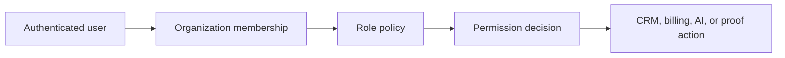

# Architecture

AgencyOS AI starts as a modular monolith. This keeps the product fast to ship while preserving clear boundaries for future service extraction.

## Modules

| Module | Responsibility |
| --- | --- |
| Identity | Profiles, organizations, memberships, roles |
| Access Control | Permission checks and role policy |
| CRM | Clients, leads, deals, tasks, notes |
| AI | Client summaries, drafts, document review |
| Billing | Invoices, subscription state, payments |
| Proofs | Hash generation and blockchain proof records |

## Access Control Flow

## Current Architecture Decision

Build authorization as a pure TypeScript policy first. This makes the rules testable before connecting them to Supabase RLS and route handlers.
