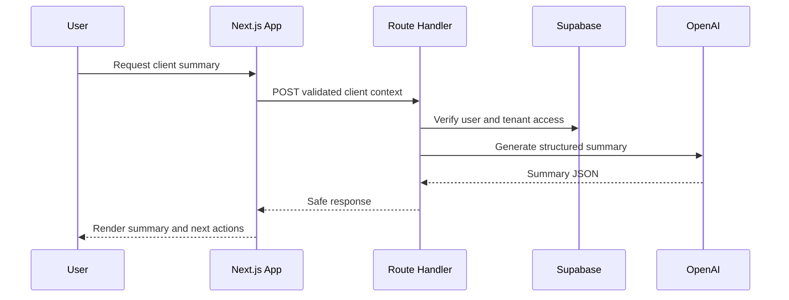

# Architecture

## Architectural Goal

AgencyOS AI is built as a modular monolith first. This gives the product a simple deployment model while keeping domain boundaries clear enough to split later if traffic, team size, or compliance requirements justify it.

## Main Modules

| Module | Responsibility |
| --- | --- |
| Identity | Authentication, profiles, organization membership, roles |
| CRM | Clients, leads, deals, notes, tasks, activity timeline |
| Billing | Invoices, payment status, subscription state |
| AI | Summaries, drafting, document review, evaluation datasets |
| Proofs | Hash generation, blockchain proof registry integration |
| Analytics | Pipeline, revenue, retention, user activity |

## Request Flow

## Server Boundary Pattern

Route handlers stay thin. They parse requests, apply shared API response helpers, enforce lightweight abuse protection, and delegate domain behavior to feature services. This keeps AI summaries, proof previews, health checks, and CRM calculations independently testable while preserving a simple Next.js deployment model.

## Tenant Model

Every business record belongs to an organization. Users access data through organization memberships. Database policies must enforce `organization_id` boundaries.

## AI Boundary

AI routes are server-side only. The frontend sends structured business context to the backend. The backend validates the input, checks tenant access, sends the minimum required context to the AI provider, and stores only approved output.

## Blockchain Boundary

The proof module stores SHA-256 hashes of important documents or actions. Raw documents and personal data are never written to-chain. On-chain proof submission will be handled by a server-side wallet or a user wallet flow depending on the final product tier.

## Deployment Model

- Web app: Vercel
- Database/Auth: Supabase
- Secrets: Vercel/Supabase environment variables
- CI: GitHub Actions
- Blockchain: EVM testnet first, mainnet only after security review
