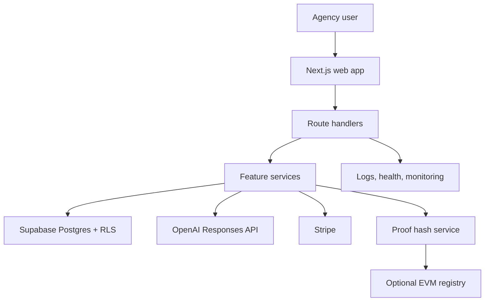

# AgencyOS AI: Master PRD And 12-Month Application Roadmap

Date: June 19, 2026
Owner: Founder / Solo Full-Stack Engineer
Status: Product strategy and execution plan

## 1. Executive Summary

### Project Vision

AgencyOS AI is an AI-native operating system for service agencies. It centralizes client records, deals, tasks, billing, team activity, AI-assisted workflows, and privacy-safe audit proofs in one SaaS workspace.

### Mission Statement

Help small and growing service agencies run like disciplined, data-driven companies without forcing them to adopt heavyweight enterprise CRM systems.

### Core Problem

Small agencies often manage clients through WhatsApp, email, spreadsheets, paper documents, and disconnected payment tools. This creates missed follow-ups, weak manager visibility, inconsistent billing, duplicate work, and poor audit history.

### Target Audience

Primary users:

- Travel, visa, Umrah, and immigration service agencies
- Tax, bookkeeping, and documentation service offices
- Real estate verification and brokerage teams
- Consulting, marketing, recruiting, and professional service agencies
- Freelancers growing into multi-person service teams

### Unique Value Proposition

AgencyOS AI combines CRM, operations, billing, AI assistance, and audit proofing for small service agencies. The product is narrower than Salesforce and HubSpot, more operational than a simple pipeline CRM, and more trustworthy than generic spreadsheet workflows.

## 2. Market And Competitor Analysis

### Industry Overview

The CRM market is large and still expanding. Fortune Business Insights estimates the global CRM market at USD 112.91B in 2025, growing to USD 320.99B by 2034 at a 12.40 percent CAGR. The same report highlights AI, cloud delivery, mobile access, lead generation, customer retention, and CRM analytics as major growth drivers.

### Market Opportunities

| Opportunity | Why It Matters |
| --- | --- |
| Vertical CRM for service agencies | Large CRMs are broad. Small agencies need opinionated workflows for clients, documents, services, invoices, reminders, and staff accountability. |
| AI operations assistant | Competitors are adding AI, but many small agencies need practical summaries, next actions, drafts, and document review before autonomous agents. |
| Trust and audit records | Agencies handle sensitive client documents. Hash-based proof records can show integrity without exposing private content. |
| Emerging market agencies | Many agencies in South Asia, Middle East, Africa, and immigrant communities still run on chat apps and spreadsheets. |
| Portfolio and career value | The project demonstrates SaaS architecture, AI integration, security, testing, deployment, and product thinking. |

### Competitor Comparison

| Competitor | Strengths | Weakness For This Niche | AgencyOS AI Position |
| --- | --- | --- | --- |
| Salesforce | Enterprise CRM, AI agents, large ecosystem, industry clouds | Expensive, complex, implementation-heavy | Lightweight vertical SaaS for small agencies |
| HubSpot | Strong SMB CRM, marketing, sales, service, Breeze AI | Can become costly and broad; less agency-service specific | More focused on agency operations and audit proofing |
| Zoho CRM | Affordable suite, Zia AI, automation, analytics | Broad suite with setup complexity | Opinionated workflows for service delivery |
| Pipedrive | Excellent sales pipeline UX and AI sales assistant | Mostly sales-focused, weaker operations/billing/audit layer | CRM plus service execution |
| ServiceTitan | Strong vertical platform for trades | Focused on field service and trades, not general agencies | Similar vertical playbook for non-trade service agencies |

### Competitive Advantages

- Narrow ICP: small service agencies, not every business.
- Modular monolith architecture that is easy to ship and later split.
- Built-in AI summaries, drafts, document assistance, and evaluation plan.
- Tenant-aware database model from day one.
- Privacy-safe blockchain proof approach: hash only, never raw client data.
- Recruiter-friendly engineering: docs, CI, tests, security model, PRD, and roadmap.

### Risks And Challenges

| Risk | Severity | Mitigation |
| --- | --- | --- |
| Competing against mature CRMs | High | Pick a narrow vertical and solve agency-specific workflows better. |
| AI cost and reliability | High | Add caching, rate limits, prompt evals, fallback responses, and usage quotas. |
| Tenant data leakage | Critical | Enforce Supabase RLS, server authorization, and scoped queries. |
| Overbuilding blockchain | Medium | Keep proofing optional and hash-only until real user demand exists. |
| Solo developer scope creep | High | Ship monthly vertical slices and defer marketplace/mobile/complex accounting. |

## 3. Product Requirements Document

### Product Overview

AgencyOS AI is a B2B SaaS application where an agency owner creates an organization, invites agents, tracks clients and deals, assigns tasks, generates invoices, gets AI summaries, and creates audit proof hashes for important records.

### Business Objectives

| Objective | 12-Month Target |
| --- | --- |
| Product validation | Interview 20 agencies and onboard 5 to 10 beta teams |
| MVP maturity | Ship auth, CRM, tasks, billing foundation, AI summaries, proof preview |
| Engineering quality | Maintain CI, tests, docs, security checklist, deployment pipeline |
| Revenue signal | Convert 2 to 3 beta agencies to paid pilots |
| Career signal | Publish demo, case study, architecture docs, and public build logs |

### User Personas

| Persona | Goals | Pain Points |
| --- | --- | --- |
| Agency Owner | Revenue visibility, staff accountability, client retention | No single view of pipeline, invoices, or task quality |
| Operations Manager | Assign work, monitor deadlines, standardize process | Follow-ups are scattered across chats and spreadsheets |
| Agent / Case Worker | Serve clients faster, know next step, reduce writing | Manual notes, repeated messages, unclear priorities |
| Finance/Admin | Track invoices, payment status, client balances | Billing is disconnected from client records |
| Client-facing Consultant | Build trust with accurate history and proof records | Hard to prove document/action integrity |

### User Stories

Must-have MVP stories:

- As an owner, I can create an organization so my agency data is separated from others.
- As an owner, I can invite team members and assign roles.
- As an agent, I can create and update clients, deals, tasks, and notes.
- As a manager, I can view a dashboard of pipeline value, revenue, overdue work, and risky clients.
- As an agent, I can generate an AI client summary from structured client context.
- As an admin, I can create invoice records and track payment status.
- As an owner, I can create a proof hash for important records without exposing private content.

Should-have stories:

- As a manager, I can search and filter clients, deals, tasks, and invoices.
- As an agent, I can generate message and email drafts.
- As an owner, I can export CSV reports.
- As an admin, I can view audit logs for sensitive changes.

### Functional Requirements

| Area | Requirements |
| --- | --- |
| Identity | Supabase Auth, organizations, memberships, roles, tenant-aware sessions |
| CRM | Clients, leads, deals, notes, tasks, statuses, activity timeline |
| Dashboard | Pipeline, revenue, task health, proof count, risk alerts |
| AI | Client summary, email draft, document summary, prompt versioning, evaluation dataset |
| Billing | Invoice records, payment status, Stripe checkout, subscription plans |
| Proofs | Canonical hash generation, proof records, verification page, optional testnet contract |
| Admin | Team management, role controls, settings, audit log |
| Reporting | CSV export, owner dashboard, stage conversion, overdue tasks |

### Non-Functional Requirements

| Category | Requirement |
| --- | --- |
| Performance | Dashboard first load under 2.5s on broadband, API p95 under 500ms excluding AI calls |
| Reliability | Health endpoint, error boundaries, retries where safe, no-store API responses |
| Security | RLS, server authorization, input validation, rate limits, secret hygiene, security headers |
| Scalability | Modular monolith, indexed tenant queries, background jobs for heavy work |
| Maintainability | Feature modules, typed schemas, tests for domain logic, ADRs for major decisions |
| Accessibility | WCAG 2.1 AA target, keyboard navigation, semantic headings, visible focus states |
| Observability | Structured logs, error tracking, uptime checks, AI cost metrics |

### Success Metrics

| KPI | Target |
| --- | --- |
| Activation | 70 percent of new agencies create at least 5 clients in first week |
| Engagement | 3 weekly active users per beta agency |
| Operational value | 30 percent reduction in missed follow-ups reported by beta users |
| AI usefulness | 70 percent thumbs-up on generated summaries and drafts |
| Reliability | 99.5 percent uptime during beta |
| Quality | Critical flows covered by Playwright and core logic covered by unit tests |
| Business | 2 to 3 paid pilots by Month 12 |

### Acceptance Criteria

- Users cannot access another organization's data.
- CRM records are CRUD-capable and tenant-scoped.
- Dashboard metrics match database values.
- AI endpoints validate input, rate limit requests, and return structured JSON.
- Proof hashes are deterministic for canonical payloads.
- Billing records support invoice lifecycle states.
- Production deployment passes lint, typecheck, unit tests, build, and core e2e tests.

### Technical Constraints

- Use Next.js App Router and TypeScript.
- Use Supabase for auth, Postgres, and RLS.
- Use server-side OpenAI integration only.
- Keep blockchain proofing optional until after MVP.
- Avoid native mobile app in year one.

### Compliance And Security Requirements

- Do not store raw secrets in Git.
- Do not send unnecessary PII to AI providers.
- Keep service role keys server-side only.
- Store blockchain proofs as hashes and safe metadata only.
- Prepare for GDPR-style deletion/export and audit requirements.
- Add privacy policy and terms before public beta.

## 4. Feature Breakdown And MoSCoW Prioritization

| Priority | Features |
| --- | --- |
| Must Have | Auth, organizations, memberships, RLS, clients, deals, tasks, notes, dashboard, AI client summary, proof preview, CI, deployment |
| Should Have | Search, filters, activity timeline, invoice tracking, Stripe subscription, audit logs, CSV export, AI drafts |
| Could Have | Document upload, document summary, WhatsApp/email integrations, notification center, role-specific dashboards |
| Won't Have In Year 1 | Native mobile app, complex accounting, payroll, full marketplace, mainnet blockchain dependency, autonomous financial decisions |

### Phases

| Phase | Scope |
| --- | --- |
| MVP | Multi-tenant CRM, dashboard, AI summary, invoice foundation, proof preview, deployment |
| Phase 2 | Stripe billing, audit logs, CSV export, message drafts, onboarding, beta feedback loop |
| Advanced | Document review, workflow automation, integrations, analytics read models |
| Scale | Background jobs, caching, Redis rate limits, monitoring, enterprise permissions |

## 5. Technical Architecture

### Recommended Stack

| Layer | Technology |
| --- | --- |
| Frontend | Next.js, React, TypeScript, Tailwind CSS, lucide-react |
| Backend | Next.js route handlers, feature services, Zod validation |
| Database/Auth | Supabase Postgres, Supabase Auth, Row Level Security |
| AI | OpenAI Responses API, structured outputs, prompt evals |
| Payments | Stripe Checkout and Billing Portal |
| Proofs | SHA-256 proof records, Solidity/Foundry later for testnet registry |
| Testing | Vitest, Playwright, ESLint, TypeScript |
| Hosting | Vercel, Supabase, GitHub Actions |
| Monitoring | Vercel logs, Sentry, uptime monitoring, Postgres backups |

### Architecture Diagram

### Backend Structure

- `src/app`: UI pages and HTTP route handlers.
- `src/features`: domain-specific services for CRM, AI, health, proofs, billing.
- `src/lib`: shared utilities, API responses, environment, formatting, rate limiting.
- `supabase/migrations`: schema, RLS policies, seed/demo data.
- `tests/e2e`: browser-level product workflows.

### Database Design

Core entities:

- `organizations`
- `profiles`
- `memberships`
- `clients`
- `deals`
- `tasks`
- `activity_events`
- `invoices`
- `ai_artifacts`
- `proof_records`
- `audit_logs`

Key rules:

- Every tenant-owned table has `organization_id`.
- Store money in integer minor units.
- Use enums/constrained values for statuses and roles.
- Add indexes only after query patterns are known.
- RLS policies are required before beta users enter real data.

### API Structure

| Method | Endpoint | Purpose |
| --- | --- | --- |
| GET | `/api/health` | Readiness and dependency status |
| POST | `/api/ai/client-summary` | Structured AI summary |
| POST | `/api/blockchain/proof-preview` | Local proof hash preview |
| GET/POST | `/api/clients` | Client listing and creation |
| GET/PATCH/DELETE | `/api/clients/:id` | Client detail lifecycle |
| GET/POST | `/api/deals` | Pipeline records |
| GET/POST | `/api/tasks` | Task workflow |
| GET/POST | `/api/invoices` | Invoice records |

### Auth And Authorization

- Supabase Auth for login.
- `memberships` table maps user to organization and role.
- Roles: owner, admin, manager, agent, viewer.
- Server route must verify organization membership before data access.
- RLS is final enforcement layer, not optional.

### DevOps And CI/CD

- GitHub Actions: install, lint, typecheck, unit tests, build.
- Add Playwright smoke tests after preview deployment.
- Use Vercel preview deployments for PRs.
- Use protected `main` branch and PR templates.
- Add Dependabot and dependency review.

### Security Architecture

- Input validation with Zod.
- Shared error response helpers.
- No-store headers for API responses.
- Baseline HTTP security headers.
- Server-only AI provider calls.
- Rate limits for AI endpoints.
- Tenant authorization and RLS.
- Audit logs for sensitive writes.

## 6. UI/UX Strategy

### User Journey Map

| Step | Owner Journey | Agent Journey |
| --- | --- | --- |
| Onboard | Create agency, invite team, import clients | Accept invite, see assigned work |
| Operate | Review dashboard, pipeline, overdue work | Update clients, tasks, notes, deals |
| Assist | Use AI summaries and drafts | Generate next actions and message drafts |
| Bill | Review invoices and payment status | Attach invoice context to client |
| Trust | Create proof records for key documents | Verify record integrity when needed |

### Information Architecture

- Dashboard
- Clients
- Deals / Pipeline
- Tasks
- Invoices
- AI Assistant
- Proofs
- Reports
- Team
- Settings

### Screen Hierarchy

1. Dashboard command center
2. Client list and client detail
3. Deal pipeline board
4. Task board/list
5. Invoice list/detail
6. AI assistant panel
7. Proof verification page
8. Admin settings

### Design System Recommendations

- Use restrained SaaS dashboard styling.
- Keep cards for repeated items only.
- Use clear tables, tabs, filters, dialogs, and segmented controls.
- Use icons for repeated actions.
- Create reusable components: Button, Card, Table, Badge, EmptyState, Modal, FormField, Toast.

### Accessibility

- Semantic headings and landmarks.
- Keyboard navigation for menus, dialogs, forms, and pipeline items.
- Visible focus states.
- Text contrast AA.
- Form labels and error messages.
- No information conveyed by color alone.

### Responsive Strategy

- Desktop-first density for agency operators.
- Mobile-responsive client/task views for agents on the go.
- Avoid forcing complex admin workflows onto small screens in MVP.

## 7. 12-Month Development Roadmap

| Month | Goals | Deliverables | Testing Objective | Expected Outcome |
| --- | --- | --- | --- | --- |
| 1 | Foundation | Repo, docs, dashboard, CI, security baseline | Lint, typecheck, unit tests | Professional public project |
| 2 | SaaS Core | Supabase Auth, orgs, memberships, roles | Auth and RLS tests | Multi-tenant base |
| 3 | CRM MVP | Clients, deals, tasks, notes, activity timeline | CRUD and tenant e2e | Usable agency CRM |
| 4 | Dashboard | Pipeline, revenue, overdue work, filters, exports | Dashboard metric tests | Owner visibility |
| 5 | Billing | Invoice lifecycle, Stripe subscription, billing settings | Webhook tests | Monetization foundation |
| 6 | AI Assistant | Summary, drafts, prompt versions, eval dataset | AI contract tests | Practical AI value |
| 7 | Hardening | Audit logs, monitoring, error handling, backups | Critical e2e coverage | Beta-ready reliability |
| 8 | Proofs | Proof records, verification page, optional testnet contract | Hash and contract tests | Trust layer |
| 9 | Beta | Onboard 5 to 10 agencies, feedback, support workflow | User acceptance tests | Validated use cases |
| 10 | Scale | Indexes, caching, background job plan, performance budget | Load and p95 checks | Faster product |
| 11 | Portfolio | Demo video, screenshots, case study, README polish | Smoke tests | Recruiter-ready showcase |
| 12 | Launch | Public release, pricing, onboarding, final case study | Release checklist | Production-ready app |

## 8. Daily Contribution Plan For 365 Days

Use this operating rhythm:

- Day 1 of each week: plan issue, define acceptance criteria, update board.
- Day 2: build backend/schema/service work.
- Day 3: build frontend/UI workflow.
- Day 4: add tests and validation.
- Day 5: refactor, docs, accessibility, security pass.
- Day 6: integrate, deploy preview, record demo notes.
- Day 7: weekly review, bug fixes, retrospective, next-week planning.

### Weekly Calendar

| Days | Theme | Daily Outcome |
| --- | --- | --- |
| 1-7 | Product foundation | PRD, architecture, repo hygiene, first dashboard |
| 8-14 | Design system | UI primitives, layout, navigation, dashboard polish |
| 15-21 | Quality setup | CI, lint, typecheck, unit tests, e2e smoke |
| 22-28 | Security baseline | env hygiene, headers, validation, response helpers |
| 29-35 | Supabase setup | project config, migrations, local seed strategy |
| 36-42 | Auth | login, logout, session handling, protected routes |
| 43-49 | Organizations | org creation, membership model, tenant context |
| 50-56 | Roles | owner/admin/manager/agent/viewer permissions |
| 57-63 | RLS | policies, authorization helpers, tenant tests |
| 64-70 | Client model | client schema, list, create, detail views |
| 71-77 | Client workflows | update, archive, search, filters |
| 78-84 | Deals | schema, stages, pipeline board, summaries |
| 85-91 | Tasks | assignment, due dates, statuses, overdue logic |
| 92-98 | Notes | notes, activity events, timeline display |
| 99-105 | CRM polish | empty states, validation, loading states, e2e |
| 106-112 | Dashboard metrics | pipeline, revenue, health score, task counts |
| 113-119 | Reports | filters, date ranges, CSV export |
| 120-126 | Manager UX | agent productivity, stale deals, risk alerts |
| 127-133 | Data quality | indexes, constraints, seed/demo account |
| 134-140 | Invoice model | invoices, line items, statuses, list/detail |
| 141-147 | Invoice UX | create invoice, update payment status, reminders |
| 148-154 | Stripe setup | products, prices, checkout, billing portal |
| 155-161 | Stripe webhooks | signature verification, subscription state |
| 162-168 | Billing tests | webhook tests, invoice lifecycle e2e |
| 169-175 | AI summary | real client summary, artifacts table, usage log |
| 176-182 | AI drafts | email/message draft generation and editing |
| 183-189 | AI document flow | document text extraction plan, summary prototype |
| 190-196 | Prompt quality | prompt versions, eval examples, rating UX |
| 197-203 | AI controls | rate limits, quotas, cost logging, fallbacks |
| 204-210 | Audit logs | sensitive event model, display, filters |
| 211-217 | Observability | Sentry, logs, health checks, uptime monitor |
| 218-224 | Reliability | error boundaries, retry strategy, backup docs |
| 225-231 | Security review | RLS audit, auth tests, secret rotation checklist |
| 232-238 | Proof records | persisted proof hashes, proof detail page |
| 239-245 | Verification | public-safe verify page, QR/share link |
| 246-252 | Smart contracts | Solidity registry, Foundry tests, local deploy |
| 253-259 | Testnet integration | optional Sepolia proof submission, server wallet safety |
| 260-266 | Proof UX | user education, privacy copy, audit trail |
| 267-273 | Beta onboarding | invite flow, checklist, sample workspace |
| 274-280 | Feedback system | feedback widget, support docs, changelog |
| 281-287 | Beta fixes | top 10 beta issues, usability improvements |
| 288-294 | Notifications | in-app notifications, overdue reminders |
| 295-301 | Performance | query indexes, dashboard caching, budgets |
| 302-308 | Background jobs | queue plan, scheduled reminders, async AI jobs |
| 309-315 | Scale tests | seed large data, measure p95, optimize hot paths |
| 316-322 | UX polish | accessibility audit, responsive cleanup, copy pass |
| 323-329 | Portfolio assets | screenshots, demo script, architecture diagrams |
| 330-336 | Case study | system design writeup, tradeoffs, metrics |
| 337-343 | Public launch prep | pricing page, terms, privacy, onboarding emails |
| 344-350 | Release candidate | freeze scope, fix P0/P1 bugs, final e2e |
| 351-357 | Launch | production deploy, announcement, beta conversion |
| 358-364 | Career package | README, video, resume bullets, GitHub profile links |
| 365 | Retrospective | publish final report, plan Year 2 roadmap |

Monthly release targets:

- Month 1: Foundation release
- Month 2: Multi-tenant alpha
- Month 3: CRM MVP
- Month 4: Operations dashboard
- Month 5: Billing alpha
- Month 6: AI assistant alpha
- Month 7: Beta hardening
- Month 8: Proof system alpha
- Month 9: Private beta
- Month 10: Performance release
- Month 11: Portfolio release
- Month 12: Public launch

## 9. Project Management Framework

### Agile Workflow

- Use 1-week sprints.
- Maintain a GitHub Projects board with Backlog, Ready, In Progress, Review, Done.
- Every issue should include user story, acceptance criteria, test plan, and screenshots when UI-related.
- Ship one meaningful PR per feature slice.

### Sprint Structure

| Day | Ritual |
| --- | --- |
| Monday | Sprint planning and issue breakdown |
| Tuesday to Thursday | Build and test |
| Friday | Refactor, docs, security review |
| Saturday | Deploy preview and record demo |
| Sunday | Review metrics, close issues, plan next sprint |

### Risk Management

- Keep a risk register in `docs/RISK_REGISTER.md`.
- Review high risks monthly.
- Convert repeated bugs into tests.
- Cut scope before quality when deadlines slip.

### Resource Planning

Solo developer:

- 2 to 3 focused hours per weekday.
- 4 to 6 hours each weekend.
- 1 public update per week.
- 1 release note per month.

Small team:

- Founder/PM: discovery, prioritization, launch.
- Full-stack engineer: product build.
- Designer: design system and UX review.
- Part-time QA/security advisor after Month 7.

## 10. Financial And Business Strategy

### Development Cost Estimate

| Mode | Estimated Cost |
| --- | --- |
| Solo founder | Mostly time cost, 800 to 1,200 hours/year |
| Small team | USD 60K to 180K/year depending on geography and part-time help |
| Tools and infra | USD 50 to 300/month during build and beta |

### Infrastructure Costs

| Service | Early Cost |
| --- | --- |
| Vercel | Free to Pro tier |
| Supabase | Free to Pro tier |
| OpenAI | Usage-based, start with quotas |
| Stripe | Transaction fees |
| Sentry/Uptime | Free to low-cost startup tiers |
| Domain/email | USD 20 to 50/month |

### Monetization

| Plan | Target | Price Hypothesis |
| --- | --- | --- |
| Starter | Solo/freelance agency | USD 19 to 29/month |
| Team | Small agency | USD 49 to 99/month |
| Growth | Larger agency | USD 149 to 299/month |
| Usage Add-ons | AI credits, proof submissions, extra seats | Usage-based |

### Go-To-Market

- Start with 20 manual interviews.
- Build for one narrow segment first, such as travel/visa agencies.
- Offer concierge onboarding to first 5 agencies.
- Publish weekly build logs and case studies.
- Use demo videos, LinkedIn, GitHub, founder communities, local agency networks.

## 11. Launch Strategy

### Alpha Launch

- Timeline: Months 2 to 4.
- Audience: internal demo users and 2 friendly agencies.
- Goal: verify core CRM workflow.

### Beta Launch

- Timeline: Months 8 to 10.
- Audience: 5 to 10 agencies.
- Goal: measure activation, retention, AI usefulness, and missed follow-up reduction.

### Public Release

- Timeline: Month 12.
- Requirements: privacy policy, terms, billing, support channel, onboarding, monitoring, backup plan, core e2e tests.

### Feedback Collection

- In-app feedback widget.
- Monthly beta calls.
- Product analytics for activation and retention.
- Public changelog.
- GitHub issues for engineering transparency.

## 12. Long-Term Vision: Years 2 To 5

| Year | Focus |
| --- | --- |
| Year 2 | Deep vertical workflows, integrations, document management, paid growth |
| Year 3 | AI workflow automation, predictive analytics, partner integrations |
| Year 4 | Enterprise permissions, compliance pack, multi-region support |
| Year 5 | Marketplace, international expansion, industry-specific editions |

### Team Expansion

- First hire: full-stack/product engineer.
- Second hire: customer success/onboarding.
- Third hire: designer or frontend engineer.
- Later: security/compliance, sales, solutions engineer.

### Enterprise Opportunities

- White-label agency portals.
- Compliance-focused audit package.
- Multi-branch agency management.
- API and integration marketplace.

## 13. Final Recommendations

### Critical Success Factors

- Pick one agency vertical first.
- Ship weekly and demo monthly.
- Protect tenant data from the start.
- Make AI useful, measurable, and optional.
- Keep blockchain proofing focused on trust, not hype.
- Build public evidence: tests, docs, screenshots, deployment, case studies.

### Common Mistakes To Avoid

- Building too many verticals at once.
- Adding autonomous AI before reliable workflow AI.
- Treating RLS as a future task.
- Delaying deployment until the app is large.
- Over-polishing UI before user interviews.
- Building mainnet blockchain features before proof demand exists.

### Technical Debt Prevention

- Add tests for every business rule.
- Keep route handlers thin.
- Keep feature modules small and typed.
- Write ADRs for major architecture choices.
- Run lint, typecheck, tests, and build before merging.
- Add indexes based on measured query patterns.

### Highest-Impact Next Steps

1. Implement Supabase Auth, organizations, memberships, and RLS.
2. Build real client/deal/task CRUD against the database.
3. Add tenant authorization helpers for every API route.
4. Deploy a Vercel preview and connect Supabase.
5. Interview 5 target agencies and use findings to refine the MVP.

## Source Notes

- Fortune Business Insights CRM market report: https://www.fortunebusinessinsights.com/customer-relationship-management-crm-market-103418
- Salesforce Agentforce: https://www.salesforce.com/agentforce/
- HubSpot Breeze AI: https://www.hubspot.com/products/artificial-intelligence
- Zoho Zia AI for CRM: https://www.zoho.com/crm/zia/
- Pipedrive AI Sales Assistant: https://www.pipedrive.com/en/features/ai-sales-assistant
